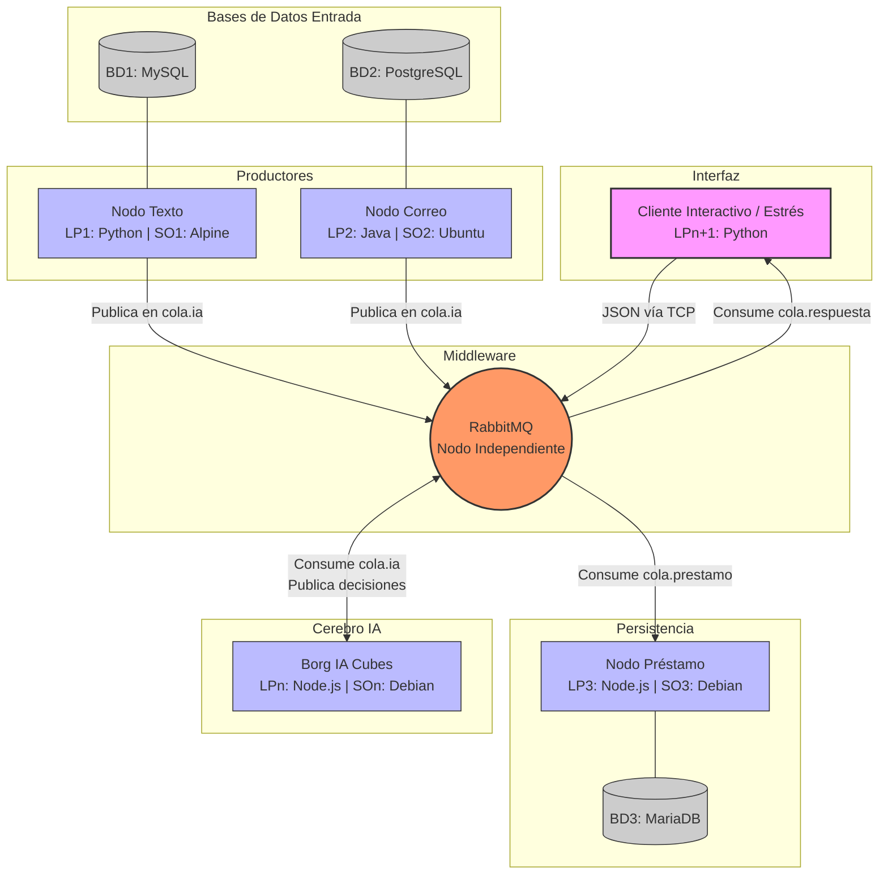
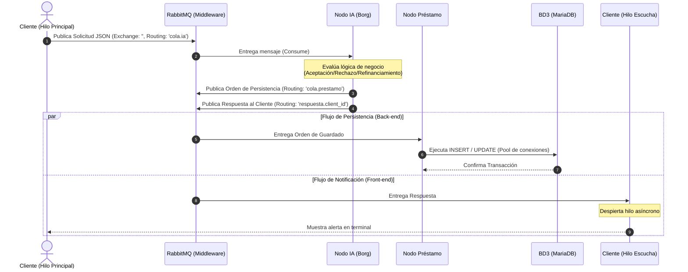

# Sistema Distribuido con Middleware de Prestamos

## Breve explicación del sistema

El desarrollo del sistema se abordó mediante una arquitectura basada en microservicios, aislando cada componente en nodos independientes para cumplir con la heterogeneidad de Sistemas Operativos (SO) y Lenguajes de Programación (LP). Para el despliegue en red, se utilizó Docker y Docker Compose, asignando imágenes base de distintas distribuciones Linux (Alpine, Ubuntu, Debian) a cada nodo.

A continuación, se detalla el desarrollo de cada módulo:

**1. Capa de Productores de Datos (LP1 y LP2)**
Esta capa simula la ingesta de datos desde fuentes externas hacia el sistema central.

* **Nodo Texto (Python sobre Alpine Linux):** Desarrollado como `LP1`. Se conecta a la base de datos MySQL (BD1) utilizando el conector oficial `mysql-connector-python`. Simula la lectura de un mensaje de texto entrante, empaqueta los datos en formato JSON nativo y los publica en el middleware (RabbitMQ) hacia la `cola.ia`.
* **Nodo Correo (Java sobre Ubuntu):** Desarrollado como `LP2`. Utiliza el controlador oficial JDBC para conectarse a PostgreSQL (BD2). Aplica expresiones regulares (Regex) nativas de Java (`java.util.regex`) para extraer el DNI, correo y monto del cuerpo del mensaje. Para cumplir estrictamente con la regla de no usar librerías de terceros (como Gson o Jackson), la serialización del objeto JSON se realiza mediante manipulación directa de cadenas (`String.format`) antes de enviarlo por el protocolo AMQP a RabbitMQ.

**2. Capa de Enrutamiento (Middleware)**

* **RabbitMQ:** Actúa como el bus de mensajes del sistema. Se configuraron colas específicas para orquestar el flujo asíncrono: `cola.ia` para concentrar las solicitudes entrantes, `cola.prestamo` para encolar las escrituras en base de datos, y colas dinámicas `respuesta.<client_id>` para retornar el resultado a cada cliente de forma aislada.

**3. Capa de Lógica de Negocio (Borg IA Cubes - LPn)**

* **Nodo IA (Node.js sobre Debian):** Actúa como el motor de decisiones. Consume continuamente los mensajes de la `cola.ia`. Mediante un árbol de decisiones (`if/else`), clasifica la intención del usuario (Solicitud, Consulta, Refinanciamiento, etc.) y evalúa el riesgo crediticio basándose en el monto solicitado. Al tomar una decisión (Aprobado, Rechazado, Refinanciado), el nodo emite dos eventos simultáneos: envía la orden de actualización a `cola.prestamo` y notifica al cliente a través de su cola de respuesta dedicada.

**4. Capa de Persistencia de Datos (LP3)**

* **Nodo Préstamo (Node.js sobre Debian):** Encargado exclusivamente de las operaciones CRUD en MariaDB (BD3). Utiliza el SDK `mariadb`. Para garantizar el rendimiento bajo estrés, implementa un *Connection Pool* nativo con un límite estricto de conexiones. Al consumir mensajes de la `cola.prestamo`, ejecuta sentencias SQL parametrizadas para crear usuarios, abrir cuentas o registrar los préstamos, evitando inyecciones SQL y garantizando la integridad referencial.

**5. Capa de Interfaz y Concurrencia (Cliente LPn+1)**
Para interactuar con el sistema y realizar las pruebas de evaluación, se desarrolló un cliente en Python con un enfoque fuerte en la concurrencia:

* **Implementación de Multihilos (Threading):** Para evitar bloqueos (deadlocks) y la caída del cliente AMQP (Pika) por cruce de sockets, se implementó el cliente separando las responsabilidades en dos hilos nativos (`threading.Thread`). Un hilo principal se encarga de capturar la entrada del usuario (o inyectar la carga de estrés) y publicar en la cola de RabbitMQ. Un segundo hilo en segundo plano (Daemon Thread) mantiene una conexión exclusiva para consumir y mostrar las respuestas asíncronas en tiempo real.
* **Evaluación de Desempeño:** Se desarrolló un módulo de estrés que inyecta automáticamente 1000 registros aleatorios. Este script calcula matemáticamente el *Throughput* (mensajes por segundo) y la Latencia Promedio restando el *timestamp* de emisión del *timestamp* de recepción de cada hilo, demostrando la capacidad del sistema distribuido para manejar alta concurrencia sin corrupción de datos.

## Diagrama de arquitectura

## Diagrama de secuencia (Protocolo)

